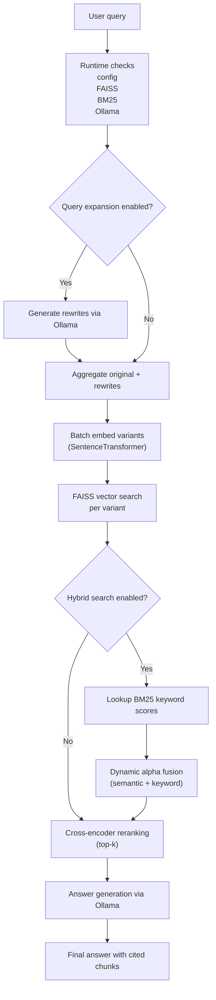
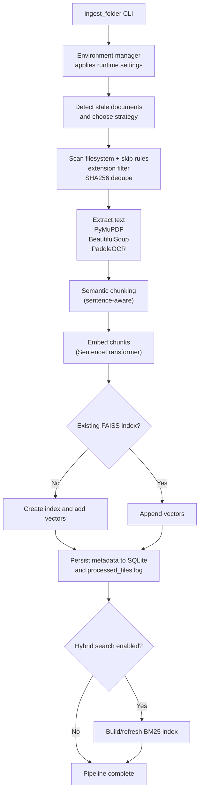

# PyRagix

PyRagix is a local-first, educational Retrieval-Augmented Generation (RAG) project that demonstrates how to compose modern retrieval techniques end-to-end. It implements query expansion, cross-encoder reranking, hybrid search (semantic + keyword), and semantic chunking so you can study how these pieces fit together without relying on hosted services.

The project favors transparency over magic. Everything runs on your workstation using Ollama-served models, FAISS, and BM25. You can inspect each step, tweak the configuration, and use the codebase as a reference when building your own privacy-respecting RAG stack.

Looking for a cross-platform .NET companion? See [pyragix-net](https://github.com/psarno/pyragix-net)!


> [!IMPORTANT]
> This repo is designed as a hands-on reference. Expect readable modules, strict typing, and pragmatic defaults rather than a turnkey "enterprise" deployment.

## Architecture

PyRagix implements coordinated ingestion and query pipelines that stay in sync through a shared metadata store.

**Query Pipeline**



**Ingestion Pipeline**



> [!NOTE]
> Query-time hybrid weighting automatically adapts to query length, giving short queries stronger keyword bias and long-form questions more semantic focus.

This architecture delivers 20-30% improved recall through query expansion, 15-25% better precision via reranking, and 30-40% better structured query handling through hybrid search.

**Performance Optimizations:**
- Batch encoding of query variants for reduced embedding overhead
- O(1) BM25 document lookup using hash-based indexing
- Optimized FAISS nprobe parameter handling
- Memory-efficient numpy array operations

## Key Features

### Learning-Focused Design
- **Traceable Pipelines**: Separate modules for ingestion, retrieval, and orchestration make it easy to step through each stage.
- **Strict Typing as Documentation**: `pyright --strict` doubles as living documentation for data flow and contracts.
- **Configurable Experiments**: Toggle query expansion, reranking, and hybrid search individually to see how each affects results.
- **Local-Only Stack**: Reproduce experiments without API keys or rate limits—perfect for classrooms, workshops, and internal trainings.

### Modern RAG Techniques
- **Query Expansion**: Generates multiple query variants to capture diverse phrasing and improve recall on ambiguous questions
- **Cross-Encoder Reranking**: Re-scores retrieved chunks using a specialized relevance model for precision
- **Hybrid Search**: Combines semantic similarity (FAISS) with keyword matching (BM25) using dynamic weighting tuned to the query
- **Semantic Chunking**: Respects sentence and paragraph boundaries to preserve context coherence

### Privacy-First Architecture
- **100% Local Operation**: All document processing, indexing, and search happen on your infrastructure
- **No External APIs**: Zero dependencies on cloud services for core functionality
- **Data Sovereignty**: Your documents never leave your network
- **Configurable Models**: Choose and run any Ollama-compatible LLM locally

### Infrastructure
- **Scalable Indexing**: FAISS IVF indexing with automatic optimization for dataset size
- **Memory Efficient**: Adaptive batch processing and intelligent memory management
- **Resumable Ingestion**: Incremental updates without reprocessing entire corpus
- **Cross-Platform**: Runs identically on Windows, Linux, and macOS
- **Modern Web UI**: Professional TypeScript-based interface with REST API (auto-compiled via dev.sh)

### Document Processing
- **Multi-Format Support**: PDF, HTML, HTM, and images (JPEG, PNG, TIFF, BMP, WEBP)
- **Advanced OCR**: PaddleOCR with adaptive DPI and tiled processing for large pages
- **Metadata Tracking**: SQLite database for chunk provenance and search filtering
- **Batch Operations**: Parallel processing with automatic retry on memory constraints

## Type Safety & Architecture

PyRagix is built with **extreme type safety** as a foundational principle. The entire codebase passes `pyright --strict` with zero errors:

### Strict Type Checking
- **Zero `# type: ignore` comments**: All types are properly defined through stubs or Protocols
- **Modern Python 3.13+ syntax**: Uses `X | None`, `list[T]`, `dict[K, V]` throughout
- **Ultra-strict pyright configuration**: 40+ type checking rules set to "error" level
- **No implicit `Any` types**: Every variable and function has explicit type annotations

### Protocol-Based Architecture
PyRagix uses Python's `Protocol` for duck-typed interfaces with third-party libraries:

```python
# Example: PDF library interface (ingestion/models.py)
class PDFPage(Protocol):
    """Protocol for PyMuPDF Page objects."""
    def get_text(self, option: str) -> str: ...
    def get_pixmap(self, dpi: int) -> PDFPixmap: ...
```

**Benefits:**
- ✅ Type-safe integration with C++ libraries (FAISS, PyMuPDF)
- ✅ Easy mocking in tests without inheritance
- ✅ Clear documentation of external API contracts
- ✅ Structural typing instead of nominal typing

### Custom Type Stubs
The `typings/` directory contains comprehensive type stubs for libraries with incomplete typing:
- **faiss**: FAISS C++ bindings with GPU detection
- **fitz (PyMuPDF)**: PDF manipulation
- **paddleocr**: OCR engine
- **rank_bm25**: BM25 algorithm
- **sqlite_utils**: Database utilities
- And more...

### Pydantic v2 Data Validation
All configuration and data models use Pydantic v2 with strict validation:

```python
# Example: Immutable metadata with validation
class MetadataDict(BaseModel):
    model_config = ConfigDict(frozen=True, validate_assignment=True)

    source: str
    chunk_index: int = Field(ge=0)  # Must be >= 0
    total_chunks: int
    file_type: str
```

**Key Models:**
- `MetadataDict`: Frozen, validated chunk metadata
- `RAGConfig`: Query pipeline configuration with type coercion
- `ProcessingConfig`: Ingestion settings dataclass
- `SearchResult`, `DocumentChunk`: Query result types

### Modular Package Design
Clean separation of concerns with explicit module boundaries:

```python
# Ingestion pipeline: ingestion/
from ingestion import (
    FAISSManager,      # Vector index management
    FileScanner,       # Document discovery
    MetadataStore,     # SQLite operations
    TextProcessor,     # Extraction pipeline
)

# Query pipeline: rag/
from rag import (
    RAGConfig,         # Configuration
    load_models,       # Model initialization
    hybrid_search,     # Multi-stage retrieval
    generate_answer,   # LLM generation
)

# Utilities: utils/
from utils import (
    BM25Index,         # Keyword search
    QueryExpander,     # Query rewriting
    Reranker,          # Cross-encoder scoring
)
```

This architecture ensures maintainability, testability, and type safety across 3000+ lines of strictly-typed Python code.

## Quick Start

### Prerequisites

1. **Python 3.13+** with uv package manager (recommended) or pip
2. **Ollama** for local LLM inference - download from [ollama.com](https://ollama.com)
3. **8GB+ RAM** (16GB+ recommended for optimal performance)

> [!TIP]
> Use `uv sync --frozen` in CI or shared environments to guarantee the resolved versions match the committed `uv.lock`.

### Installation

```bash
# Clone repository
git clone https://github.com/psarno/PyRagix.git
cd PyRagix

# Install dependencies with uv (recommended - fast and reliable)
uv sync

# Or with pip (installs from pyproject.toml)
pip install -e .

# Pull Ollama model for local LLM
ollama pull qwen2.5:7b
ollama serve
```

### Basic Usage

```bash
# Ingest documents (builds FAISS + BM25 indexes)
uv run python ingest_folder.py --fresh ./docs
# Append --verbose to stream per-file timings instead of the default spinner-driven progress UI.

# The CLI now validates that FAISS/BM25 artifacts exist before querying.

# Start web interface (compiles TypeScript frontend and starts server)
./dev.sh
# Open http://localhost:8000/web/

# Or use console interface
uv run python query_rag.py --verbose
# Use --no-spinner if your terminal does not support carriage returns.
```

## Configuration

PyRagix uses `settings.toml` for all configuration. The file is auto-generated with optimal defaults for your system on first run. A template is available at `settings.example.toml`.

Enable modern RAG techniques:

```toml
[query_expansion]
ENABLE_QUERY_EXPANSION = true
QUERY_EXPANSION_COUNT = 3

[reranking]
ENABLE_RERANKING = true
RERANKER_MODEL = "cross-encoder/ms-marco-MiniLM-L-6-v2"
RERANK_TOP_K = 20

[hybrid_search]
ENABLE_HYBRID_SEARCH = true
HYBRID_ALPHA = 0.7

[semantic_chunking]
ENABLE_SEMANTIC_CHUNKING = true
SEMANTIC_CHUNK_MAX_SIZE = 1600
SEMANTIC_CHUNK_OVERLAP = 200
```

**Query Expansion**: Set `ENABLE_QUERY_EXPANSION: true` to generate multiple query variants. This improves recall by 20-30% on paraphrased or ambiguous queries. Adjust `QUERY_EXPANSION_COUNT` (default: 3) to control the number of variants.

**Reranking**: Enable `ENABLE_RERANKING: true` to re-score retrieved chunks with a cross-encoder model. This improves precision by 15-25% by filtering out keyword-matched but semantically irrelevant chunks. `RERANK_TOP_K` controls the candidate pool size (default: 20).

**Hybrid Search**: Set `ENABLE_HYBRID_SEARCH: true` to combine FAISS semantic search with BM25 keyword matching. This dramatically improves structured queries (names, dates, IDs) by 30-40%. `HYBRID_ALPHA` provides the baseline fusion weight (0.7 = 70% semantic, 30% keyword), and PyRagix dynamically adjusts this balance per query length for better recall.

**Semantic Chunking**: Enable `ENABLE_SEMANTIC_CHUNKING: true` to chunk documents at sentence boundaries instead of fixed character counts. This preserves context coherence and improves answer quality.

**Performance Impact**: Enabling all features adds approximately 300-700ms per query (query expansion + hybrid fusion + reranking), which is negligible compared to LLM generation time. Features can be enabled incrementally for A/B testing.

### Hardware Tuning

For memory-constrained systems (8-12GB RAM):
```toml
[embeddings]
BATCH_SIZE = 8

[threading]
TORCH_NUM_THREADS = 4

[pdf]
BASE_DPI = 100
```

For high-performance systems (32GB+ RAM):
```toml
[embeddings]
BATCH_SIZE = 32

[threading]
TORCH_NUM_THREADS = 12

[pdf]
BASE_DPI = 200

[faiss]
NLIST = 2048
NPROBE = 32
```

### LLM Configuration

Customize Ollama model and generation parameters:
```toml
[llm]
OLLAMA_MODEL = "qwen2.5:7b"
TEMPERATURE = 0.1
TOP_P = 0.9
MAX_TOKENS = 500
REQUEST_TIMEOUT = 180

[retrieval]
DEFAULT_TOP_K = 7
```
## Advanced Usage

### Incremental Ingestion

Add new documents without reprocessing:
```bash
# Initial ingestion
uv run python ingest_folder.py ./docs

# Later: add more documents (automatically skips processed files)
uv run python ingest_folder.py ./more_docs
```

### Custom Document Filters

Skip specific file types or patterns:
```toml
[pdf]
SKIP_FILES = ["*.tmp", "backup_*", "archive/*"]
```

### FAISS Index Optimization

PyRagix ships with IVF (Inverted File) indexing enabled in the default settings for fast search on large corpora, while automatically falling back to flat indexing when the corpus is small or IVF training fails:

```toml
[faiss]
INDEX_TYPE = "ivf"
NLIST = 1024
NPROBE = 16
```

- **NLIST**: Number of clusters (default: 1024). Increase for larger datasets (10k+ chunks).
- **NPROBE**: Search clusters (default: 16). Higher values improve recall at the cost of speed.

The system automatically falls back to flat indexing for small collections (< 2048 chunks), then upgrades to IVF as your corpus grows.

### GPU Acceleration

PyRagix includes GPU detection with automatic CPU fallback:

```toml
[gpu]
GPU_ENABLED = true
GPU_DEVICE = 0
GPU_MEMORY_FRACTION = 0.8
```

Note: GPU FAISS requires compatible hardware and special installation. The system works perfectly with CPU-only FAISS (default).

## Project Structure

PyRagix uses a modular architecture with clear separation of concerns:

```
PyRagix/
├── ingest_folder.py         # Document ingestion CLI wrapper
├── query_rag.py             # Console query CLI with spinner/Ollama checks
├── dev.sh                   # Frontend build + FastAPI server launcher
├── config.py                # Pydantic-backed runtime configuration
├── types_models.py          # Shared Pydantic models (MetadataDict, RAGConfig, etc.)
├── CHANGELOG.md             # Release notes
│
├── ingestion/               # Document processing pipeline
│   ├── cli.py               # CLI argument parsing and path safety guards
│   ├── environment.py       # Environment tuning and shared context creation
│   ├── faiss_manager.py     # FAISS index creation/persistence helpers
│   ├── file_scanner.py      # Extraction, chunking, embedding, persistence
│   ├── progress.py          # Spinner-based progress reporting
│   ├── pipeline.py          # Top-level orchestration + BM25 rebuild
│   └── ...                  # metadata_store.py, text_processing.py, stale_cleaner.py, etc.
│
├── rag/                     # Query-time retrieval pipeline
│   ├── configuration.py     # Runtime defaults + validation
│   ├── loader.py            # Load FAISS/metadata/embedder
│   ├── llm.py               # Ollama client with retry/backoff
│   ├── retrieval.py         # Hybrid retrieval, dynamic alpha, reranking
│   └── __init__.py          # Lazy re-exports to avoid heavy imports
│
├── utils/                   # Shared utilities
│   ├── bm25_index.py        # BM25 persistence and search helpers
│   ├── faiss_importer.py    # Centralised FAISS import/warning suppression
│   ├── faiss_types.py       # Protocols for FAISS type safety
│   ├── ollama_status.py     # Ollama health probes and caching
│   ├── query_expander.py    # Multi-query expansion via Ollama
│   ├── reranker.py          # Cross-encoder reranker wrapper
│   └── spinner.py           # Lightweight CLI spinner
│
├── web/                     # Web UI + API server
│   ├── server.py            # FastAPI server with health + visualization endpoints
│   ├── visualization_utils.py # Embedding visualization helpers
│   └── ...                  # TypeScript sources, static assets, dev scripts
│
├── tests/                   # Pytest suite
│   ├── test_rag_configuration.py   # Runtime validation coverage
│   ├── test_retrieval_dynamic_alpha.py # Dynamic hybrid alpha tests
│   └── ...                  # Ingestion/environment regression tests
└── typings/                 # Third-party type stubs (keep pyright --strict green)
    └── ...
```

**Architecture Highlights:**
- **Modular Packages**: Clear separation between ingestion, query, and utility logic
- **Protocol-Based Typing**: Uses Python Protocols for duck-typed interfaces (PDF libraries, OCR)
- **Type Safety**: All code passes `pyright --strict` with comprehensive type stubs
- **Pydantic v2**: Data validation and serialization throughout
- **Test Coverage**: Pytest suite with fixtures for all major components

## Dependencies

PyRagix uses modern Python 3.13+ with strict type safety. All dependencies managed via `pyproject.toml`:

**Core ML/AI:**
- **torch** (2.9+): Embedding model backend with CUDA support
- **sentence-transformers**: Dense embeddings and cross-encoder reranking
- **transformers**: HuggingFace model infrastructure
- **faiss-cpu** (1.12+): High-performance vector search with IVF indexing
- **rank-bm25**: BM25 keyword search for hybrid retrieval

**Document Processing:**
- **paddleocr**: OCR for images and scanned documents
- **paddlepaddle** (3.2+): PaddleOCR backend
- **pymupdf**: PDF text extraction
- **beautifulsoup4**: HTML parsing
- **langchain-text-splitters**: Semantic chunking with sentence boundaries
- **pillow**: Image processing

**Data & Infrastructure:**
- **fastapi**: Web API and UI server
- **uvicorn**: ASGI server with WebSockets
- **sqlite-utils**: Metadata database management
- **pydantic**: Data validation and settings management
- **numpy**: Numerical operations

**Utilities:**
- **scikit-learn**: ML utilities (used by reranker)
- **umap-learn**: Dimensionality reduction (visualization)
- **psutil**: System resource monitoring
- **requests**: HTTP client
- **tenacity**: Resilient retry/backoff decorators for Ollama and ingestion pipelines

**Development Tools:**
- **pyright**: Strict static type checking
- **ruff**: Fast Python linter and formatter
- **pytest**: Testing framework

**Installation:**
```bash
# Recommended: Use uv for fast, reliable dependency management
uv sync

# Alternative: Traditional pip installation
pip install -e .

# Development dependencies
uv sync --dev
```

All dependencies are pinned to minimum versions. PyRagix requires Python 3.13+ and makes no backwards compatibility compromises.

## Why PyRagix?

**Hands-on Learning**: Trace how ingestion, retrieval, reranking, and generation work by reading approachable, well-typed modules.

**Privacy by Default**: All processing stays on your workstation or lab machine—ideal for demos where data cannot leave the room.

**Configurable Experiments**: Toggle features, swap models, and observe how each change impacts retrieval and answer quality.

**Transparency**: The entire stack is Python with strict typing and tests, making it easier to reason about than black-box services.

**Affordable Exploration**: No per-query API fees or vendor lock-in. If you have hardware that can run Ollama, you can run PyRagix.

**Path to Production**: While scoped for education, the patterns (metadata store, hybrid retrieval, retries) mirror those used in larger systems, giving you a blueprint for future scaling efforts.

## Use Cases

- **Workshops & Study Groups**: Walk learners through each stage of a RAG stack without cloud dependencies or hidden services.
- **Internal Knowledge Prototypes**: Stand up proof-of-concept search experiences over private wikis before investing in heavier tooling.
- **Legal / Regulated Labs**: Experiment with RAG techniques on sensitive corpora that must stay on-prem.
- **Engineering Enablement**: Teach platform teams how retrieval quality improves with expansion, hybrid search, and reranking toggles.
- **Personal Knowledge Management**: Create private search engines over personal notes, books, and research with full control.

## CI/CD

PyRagix includes GitHub Actions workflows for automated quality assurance:

- **CI Workflow**: Runs on every push and pull request
  - Type checking with `pyright --strict`
  - Linting and formatting with `ruff`
  - Full test suite with `pytest`
  - Ensures Python 3.13+ compatibility

- **Publish Workflow**: Automated package publishing (when configured)

All code must pass strict type checking and tests before merging.

## Contributing

Contributions are welcome.

**Development Setup:**
```bash
git clone https://github.com/psarno/PyRagix.git
cd PyRagix
uv sync
```

**Code Quality Standards:**

PyRagix maintains **strict type safety** as a core principle. All code must pass `pyright --strict` with zero type errors:

**Type Safety (Non-Negotiable):**
- ✅ All code passes `pyright --strict` (zero errors, minimal warnings)
- ✅ Modern Python 3.13+ syntax: `X | None`, `list[T]`, `dict[K, V]` (not `Optional`, `List`, `Dict`)
- ✅ Pydantic v2 for all data models with validation
- ✅ Protocol-based typing for duck-typed interfaces (PDF libraries, OCR)
- ✅ Comprehensive type stubs in `typings/` for third-party libraries
- ❌ **NO `# type: ignore` comments** - use proper type stubs or `cast()` instead
- ❌ **NO `Any` types** except for legitimate sentinel values and validators

**Code Structure:**
- Modular packages with clear separation of concerns
- Protocol definitions in `ingestion/models.py` for external library interfaces
- Pydantic models for all data validation and serialization
- Pytest tests with fixtures for new features

**Development Workflow:**
```bash
# Type check (must pass before committing)
uv run pyright

# Run tests
uv run pytest

# Lint and format
uv run ruff check .
uv run ruff format .
```

**Contributing Guidelines:**
- Update type stubs if adding new third-party library features
- Add docstrings to Protocol definitions explaining their purpose
- Write tests for new functionality using pytest fixtures from `tests/conftest.py`
- Follow existing patterns: see `ingestion/` and `rag/` packages for examples

## License

MIT License - see [LICENSE](LICENSE) for details.

## Acknowledgements

PyRagix builds on the shoulders of giants:
- FAISS (Meta AI Research)
- Sentence Transformers (UKP Lab)
- Ollama (Ollama Team)
- PaddleOCR (PaddlePaddle)
- LangChain (LangChain AI)

**Built with privacy, performance, and pragmatism in mind.**
